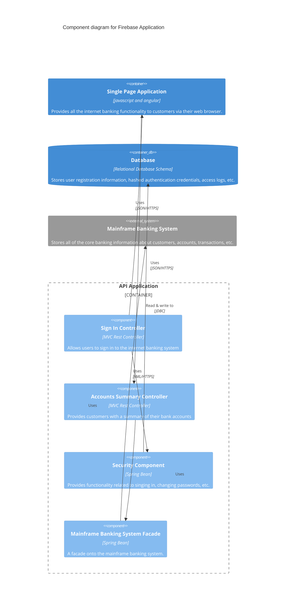

My first introduction to [Firebase Hosting](https://firebase.google.com/docs/hosting) was about 4 years ago in 2021, when my hammer for everything was Kubernetes. That meant bundling Angular applications into an nginx container, and configuring an ingress to route traffic to it.

I'd also just discovered [gRPC](https://grpc.io/) and I went a little crazy with it, because I _wanted_ to do microservices like everyone else. Many, many container builds later, I had to make a one-off contribution to a site hosted in Firebase, and I was blown away by the ease of use, especially the ability to create preview channels. I've seen this done elsewhere using AWS Cloudfront and a lambda function to map a uri served from a wildcard subdomain to an S3 prefix, but it was just so much simpler in one all-encompassing platform.

On the backend side, I learned to structure application code in a different way: an abstracted handler that could be mounted in serverless contexts (e.g. Firebase Functions or Google Cloud Functions Framework) or in a more traditional server listener context. My languages were go and javascript/typescript, but the challenges were the same:

- Stripping an arbitrary prefix (or prefixes) from an incoming URL. When mapping a path using hosting rewrites, requests to a function called `api`, could come in as `/api/api/<path>` when coming from hosting mapped to the prefix `/api`, `/api/<path>` when accessed directly, or just `/<path>` when using the Firebase emulator.
- (Node only): Reconstituting a request body, or finding the right middleware to handle some content types and uploads. Uploads in particular were next to impossible in some cases, so an acceptable compromise was to upload to Google Cloud Storage, then to resume processing with a [trigger](https://firebase.google.com/docs/functions/gcp-storage-events?gen=2nd).
- Determining processing timeouts, resource usage and concurrency. I love infrastructure, but I don't particularly enjoy managing it. Serverless workloads like Cloud Run and Cloud Functions were easy to write code for, but in at least one situation ended up being a nightmare balancing costs, timeout limitations on long-running tasks, cold starts and scaling limitations, as well as poor integration with stateful storage.

