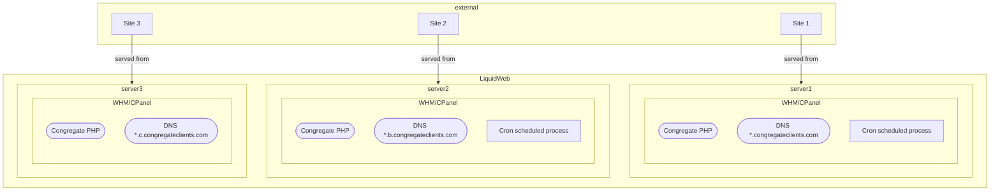
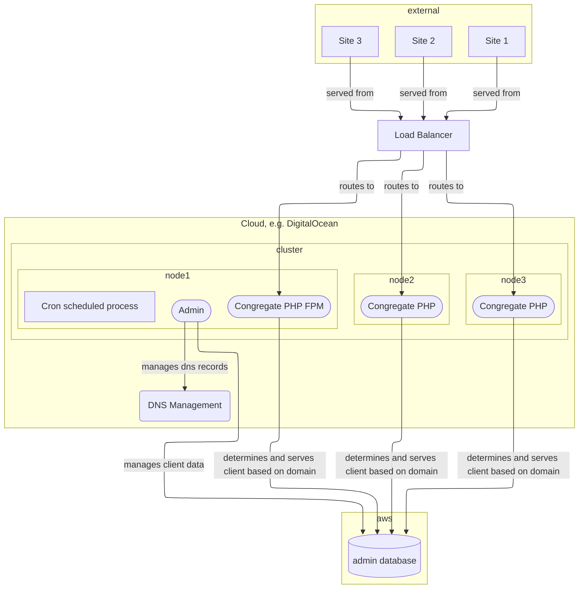
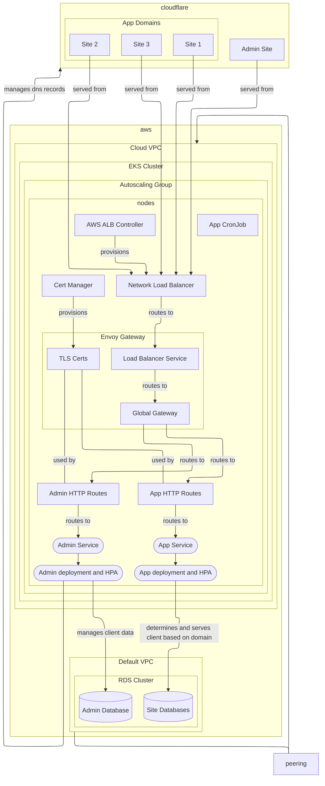

In April 2009, I was a junior at the now
defunct [Mountain State University](https://en.wikipedia.org/wiki/Mountain_State_University) in West Virginia. At the
time I made a modest freelance income customizing themes and plugins for some of the common PHP CMSes at the time,
especially WordPress.

I took on a project to customize WordPress for a church website: normal CMS functions with a member directory, job
scheduling and reminders, a calendar and members' listing. It was hard work and severely tested, and perhaps contributed
to my ability to find answers to questions. Stack Overflow was very new, so in some cases I _was_ the one answering
questions, a lot of which haven't held up over the years :sweat_smile:.

Over time, this grew into a product called [Congregate](https://www.congregateonline.com/). It left its WordPress
origins within the first three years and was rewritten into a standalone full CMS using the defunct [Kohana framework](https://kohanaframework.org/). By
2020, mostly through word of mouth, we had over 400 sites hosted. When the pandemic hit, load increased because a lot of
the churches using the system had to deliver a lot of content virtually. Messaging (text, voice, push, email) exploded,
and there were a lot more users accessing the site.

The aging deployment architecture was starting to show cracks, but the UX was also starting to turn users off. What used
to be modern design in 2012 just wasn't cutting it in 2019. One of my big projects around then was creating an entire
API layer so the application contents could be used in a mobile application, but also to potentially decouple the
presentation layer from the application logic. This would allow people other than me to build entire UIs using modern
technologies while the application layer could evolve separately.

## Preamble

I can use the fancy word `multitenant` now, but Congregate had its roots in WordPress, which meant every site was
provisioned separately, and pointed to a different database. Over time, we moved from shared hosting to a dedicated VPS,
split out the database server (which eventually moved to Aurora RDS when I hit my limit managing it), and over time had
clients distributed across one of three VPS servers hosted on [LiquidWeb](https://www.liquidweb.com/), and
running [CPanel/WHM](https://www.cpanel.net/products/cpanel-whm-features/).

The servers had to be scaled and provisioned separately depending on usage, and for some of the larger clients, we would move them over to the newest
server (`server3`) which was provisioned with more vCPUs and RAM. We were tied to CPanel/WHM.

Provisioning was simply the owner making a new folder, creating a site in WHM/CPanel and pointing to that folder. He
would also make a database copy for the new site. A
`config.php` file lived in the folder which contained said database name, and the `index.php` file simply
included a symlinked file that loaded the rest of the application code. A simplified deployment diagram looked like
this:



I had a pretty good CI/CD configuration using Bitbucket/CircleCI which ran a lot of unit (with PHPUnit) and
acceptance/API (using Codeception) tests. Logs were piped to Loggly (acquired by SolarWinds in 2018), so troubleshooting
was somewhat manageable. I shared this with the owner:

> The current application is treated as multiple applications deployed to multiple servers. A few weaknesses of this
> approach:
>
> - Every site’s database has to be set up manually and configured separately using config files.
> - Since each site is tied to the server it’s managed on, DNS configuration is difficult, with server1 hosting the name
    servers for the congregateclients.com domain, and delegating b.congregateclients.com to server2 and
    c.congregateclients.com to server3 respectively
> - Due to how the servers were set up (mostly manually), setting up a new server if we need to scale would require
    trial and error to ensure they are configured the same way. I have some written notes, but we have made many changes
    to tune PHP/Apache and the log setup over the years that would involve a lot of trial and error to get working.
> - We are limited by the servers running on Centos 7 which is no longer supported by CPanel (
    see https://support.cpanel.net/hc/en-us/articles/19649329138327-When-will-cPanel-stop-supporting-CentOS-7)
> - It is difficult to synchronize changes across multiple servers. The deploy process uses a lot of resources, because
>   we:
>   - Deploy the code to each server via ssh/sftp
>   - Swap out a symlink between the old and new versions of the code
>   - Build any UI packages (like the theme selector for the admin)
>   - Run migrations across all sites which potentially causes the server to become unresponsive because we start one
    background process PER site
>   - We currently run into performance issues because every site runs a different php process. php-fpm (used on the demo
    site) is very performant, but due to how CPanel/WHM is set up, dedicating one fpm process per site would mean
    scaling the servers up to a ridiculous 128GB RAM per server instead of about 12-16GB.

In addition to these:

- PHP was locked at version `8.3`. We could not upgrade the Centos servers so we couldn't take advantage of any
  security / performance improvements as well as new features in `8.4`, with `8.5` just around the corner.

## So what was the trigger?

Things came to a head at the beginning of 2025. LLMs had exploded the year before, but 2025 was when AI tools hit
critical mass and the companies behind them began to hungrily scrape data from the Internet.

We were hit on two fronts: CloudFront daily bills suddenly spiked from less than $4/day to over $200/day, and the VPSes
were experiencing massive load, leading to slow loading sites and outright outages.

We had AWS WAF deployed in front of the CloudFront CDN, but the basic blocking rules were just not ready for the deluge
of requests. I spent my evenings after work searching for patterns in AWS Athena (from CloudFront logs) and tweaking WAF rules with terraform.
We had to turn on [bot control](https://docs.aws.amazon.com/waf/latest/developerguide/waf-bot-control.html), block whole
ip ranges and countries, then get creative with counting rules when we inevitably started blocking legitimate access to
large (mostly mp3) files from podcast aggregators and real users, or images from email clients. Luckily, when we reached
out to AWS Support, we were able to get a refund/account credit, with the only requirement being that we turn
on [AWS Cost Anomaly Detection](https://aws.amazon.com/aws-cost-management/aws-cost-anomaly-detection/).

LiquidWeb, our host had to implement site-wide mod_security rules which caused
an [incident](https://status.liquidweb.com/incidents/15cjwkx21b7s), and Cloudflare
announced [pay per crawl](https://blog.cloudflare.com/introducing-pay-per-crawl/) around the same time. Clearly,
everyone was affected.

Once we blocked large file access, the crawlers started to target text content and our RDS external data transfer costs
spiked heavily given every page load pulls data from the database. LiquidWeb was able to identify abusive IPs but we
were playing whackamole with these, and there was always a new set when we asked. Clearly, this couldn't go on.

Eric, the owner of the application asked what could be done on our side, so I sent the diagram below, along with a
proposal:



> What the new design achieves is:
>
> - We can make the application more performant because we can easily scale up and down to handle peak loads (e.g. on
    Sundays)
> - We can isolate our infrastructure from public access
> - We can have a centralized database where client data lives, which allows us to build an admin panel to manage client
    domains, as well as to instantly provision a new site and turn sites on / off. We can also centralize the management
    of configuration instead of needing to log into every site as a sysop user, e.g. for configuring modules and
    features.
> - It becomes easier to monitor the sites as we can centralize logging and error reporting (I have a few providers we
    can use where we fall within the free tier, similar to `<redacted>`).
>
> To build this out, we will need a minimal viable setup that demonstrates:
> - An Admin API for client management
> - A cloud provider with api support for DNS management and Kubernetes (which we’ll use for deploying the application).
> - We’ll need support for scalable load balancers which we can point the DNS records to.
> - A deployment pipeline from GitHub to the setup.
> - We’ll also need to solve the case where we load directory photos from the file system. This is because we use them
    in the vcards / pdfs, but we can change how this is done.
> - 1-2 sites we can configure through the admin api to automatically sync dns to the cloud provider.

Honestly, I wasn't a 100% positive this would work. We had three types of sites hosted on the platform:

1. Domain pointed to one of the server ips.
2. Domain using one of our vanity nameservers (`ns*.congregateclients.com`) which resolved to one of the servers.
3. One of the above, but with a subdomain pointed to the application on one of the servers. I'd built an entire SSO
   system for a WordPress plugin (developed by someone else) which allowed churches more flexibility with their site
   design while integrating with the Congregate API to fetch data.

I had the vague idea that I could start on DigitalOcean (for cost reasons), then switch over to AWS when ready, but
luckily after a couple discussions, it made sense to go with AWS all the way, especially when factoring in the cost of
rewriting API calls that weren't a one-to-one mapping between both cloud services. Most of our cloud infrastructure was
already hosted there anyway:

- S3 for file storage
- CloudFront as a CDN
- Aurora RDS as the primary data store
- AWS Transcribe Jobs for sermons audio to speech
- SQS for message queues and background processing

## Solution

This seemed like a perfect use-case for Kubernetes, specifically AWS EKS. Containerization would resolve all (or most
of) our dependency issues, and I was already familiar with a few open source projects
like [cert-manager](https://cert-manager.io/) for dynamic SSL certificate provisioning
and [external-dns](https://github.com/kubernetes-sigs/external-dns) with AWS Route53 integration. This seemed _doable_
and I was excited.

The servers + backup on LiquidWeb were costing somewhere around $170/month per server, and 
optimistically, we could get our costs somewhere around $450/month while future-proofing the application and infrastructure. 

This was where we ended up:

[//]: # (```mermaid)

[//]: # (architecture-beta)

[//]: # (    group cloudflare&#40;logos:cloudflare-icon&#41;[Cloudflare])

[//]: # (    group aws&#40;logos:aws&#41;[AWS Cloud])

[//]: # (    group defaultvpc&#40;logos:aws-vpc&#41;[Default VPC] in aws)

[//]: # (    group cloudvpc&#40;logos:aws-vpc&#41;[Cloud VPC] in aws)

[//]: # (    group cluster&#40;logos:aws-eks&#41;[EKS Cluster] in cloudvpc)

[//]: # (    group k8s&#40;logos:kubernetes&#41;[Kubernetes] in cluster)

[//]: # (    group rds&#40;logos:aws-rds&#41;[RDS Cluster] in defaultvpc)

[//]: # (    group asg&#40;logos:aws-ec2&#41;[EKS Autoscaling Group] in cloudvpc)

[//]: # ()

[//]: # (    service domain1&#40;carbon:dns-services&#41;[Domain 1] in cloudflare)

[//]: # (    service domain2&#40;carbon:dns-services&#41;[Domain 2] in cloudflare)

[//]: # ()

[//]: # (    service elasticip1&#40;carbon:lightning&#41;[Elastic IP] in cloudvpc)

[//]: # (    service elasticip2&#40;carbon:lightning&#41;[Elastic IP] in cloudvpc)

[//]: # ()

[//]: # (    service node1&#40;server&#41;[Node 1] in asg)

[//]: # (    service node2&#40;server&#41;[Node 2] in asg)

[//]: # (    service node3&#40;server&#41;[Node 3] in asg)

[//]: # ()

[//]: # (    service nlb&#40;carbon:load-balancer-network&#41;[Network Load Balancer] in cloudvpc)

[//]: # (    service lb&#40;carbon:load-balancer-local&#41;[Load Balancer Service] in k8s)

[//]: # ()

[//]: # (    service site1db&#40;database&#41;[Site1 DB] in rds)

[//]: # (    service site2db&#40;database&#41;[Site2 DB] in rds)

[//]: # (    service admindb&#40;database&#41;[Admin DB] in rds)

[//]: # ()

[//]: # (    service user&#40;carbon:user&#41;[User])

[//]: # ()

[//]: # (    service peering&#40;logos:aws-vpc&#41;[VPC Peering] in aws)

[//]: # ()

[//]: # (    junction domains)

[//]: # ()

[//]: # (    user:R -- L:domains)

[//]: # (    domain1:B -- T:domains)

[//]: # (    domain2:T -- B:domains)

[//]: # (    domains:R -- L:nlb)

[//]: # (    nlb:R -- L:lb)

[//]: # (    )

[//]: # (    elasticip1:B -- T:nlb)

[//]: # (    elasticip2:T -- B:nlb)

[//]: # ()

[//]: # (    node1{group}:B -- T:peering)

[//]: # (    peering:B -- T:site1db{group})

[//]: # (```)



There were a few moving pieces that would make this possible:

### EKS as the container orchestration platform

The [terraform-aws-modules/terraform-aws-eks](https://github.com/terraform-aws-modules/terraform-aws-eks) terraform
module had almost everything needed to setup a cluster. We used Graviton-based instances (a mix between `t4g.xlarge` and
`r6g.large`, thanks [instances.vantage.sh](https://instances.vantage.sh/)) and setup
ECR [registries](https://github.com/terraform-aws-modules/terraform-aws-ecr) for the different applications.

I had setup kubernetes clusters before on a range of cloud providers, but nothing quite prepared me for
EKS. [Access entries](https://docs.aws.amazon.com/eks/latest/userguide/access-entries.html), [addon management](https://docs.aws.amazon.com/eks/latest/userguide/eks-add-ons.html), [IAM roles for service accounts](https://docs.aws.amazon.com/eks/latest/userguide/iam-roles-for-service-accounts.html), [configuring the IAM OIDC provider for GitHub](https://github.com/terraform-aws-modules/terraform-aws-iam/tree/master/modules/iam-oidc-provider)
were just a few things I had to learn about / find. I will eventually go back and properly
implement [pod identity](https://docs.aws.amazon.com/eks/latest/userguide/pod-identities.html), maybe...

Throw in a few modules that _should_ have been addons (they frequently are elsewhere) like
the [AWS Load Balancer Controller](https://kubernetes-sigs.github.io/aws-load-balancer-controller/latest/), [Secrets Store CSI Driver](https://secrets-store-csi-driver.sigs.k8s.io/) + [AWS Secret Store Provider](https://github.com/aws/secrets-store-csi-driver-provider-aws), [Cluster Autoscaler](https://docs.aws.amazon.com/eks/latest/best-practices/cas.html)
and [Descheduler](https://github.com/kubernetes-sigs/descheduler), and cluster setup cost me a solid weekend and some.

Shoutout to [cloudposse/vpc-peering/aws](https://github.com/cloudposse/terraform-aws-vpc-peering) which saved me from a
long session of setting up VPC peering between the new cloud infrastructure and the default VPC where the existing
database lived.

I did not want to manage or do any work with
a [CNI plugin](https://kubernetes.io/docs/concepts/extend-kubernetes/compute-storage-net/network-plugins/) yet, so I
just went with the AWS [VPC CNI](https://docs.aws.amazon.com/eks/latest/best-practices/vpc-cni.html), learning
about [prefix delegation](https://docs.aws.amazon.com/eks/latest/userguide/cni-increase-ip-addresses.html) along the way
when nodes refused to schedule pods even with available resources.

### Cloudflare as the DNS provider

I was initially going to do some work with Route53 but when I ran the costs for hosted zones, I started to look
elsewhere.

As far as I knew, there was no official limit for Cloudflare with their free plan, and I'd
seen [numbers in the thousands](https://community.cloudflare.com/t/how-many-domains-can-you-have-in-your-free-account/11864/3)
thrown around, which we weren't in any danger of exceeding: at last count, we were still under 600 sites.

Considering we'd get universal SSL, and a world-class WAF at no cost, along with a well-documented API and SDK clients,
this seemed like a winner.

### Tenancy for Laravel as the tenancy resolver

I have written multitenancy systems before, and I really did not want to have to write another one for this.

Luckily, back when I created the API layer, I had created an unholy mash between the newer and more modern Laravel
framework and the original Kohana. Newer route endpoints used Laravel's routing system, but the framework was
initialized after Kohana. It was messy but it worked.

The [Tenancy for Laravel](https://tenancyforlaravel.com/) had almost everything I wanted, and for anything that wasn't
present, the documentation was very clear about how to implement them.

### Grafana Cloud for monitoring

[Grafana Cloud](https://grafana.com/products/cloud/) probably has the best free plan you can get from an observability
platform.

It does get a bit overwhelming though, and what I've learned should probably go into a separate post. I used
the [k8s-monitoring chart](https://github.com/grafana/k8s-monitoring-helm) to deploy via Helm,
the [grafana provider](https://grafana.com/docs/grafana-cloud/developer-resources/infrastructure-as-code/terraform/) to
set up applications, alerts and synthetics, and the
new [grafana-adaptive-metrics](https://registry.terraform.io/providers/grafana/grafana-adaptive-metrics/latest) provider
to cut down on metrics ingestion.

### Envoy Gateway + AWS NLB for load balancing

The major challenge faced with routing and the DNS setup here was that we needed a static set of IPs for Cloudflare or
whichever DNS provider we would use. As of the writing of this article, the recommendation from AWS is to assign static
IPs to an NLB, with an ALB serving as a target, or to use AWS Global Accelerator.

We definitely did not (for cost reasons) want to pay for Global Accelerator or for **two** load balancers.

Additionally, the [Ingress API](https://kubernetes.io/docs/concepts/services-networking/ingress/) for Kubernetes has
been frozen, and I was itching to try out the new [Gateway API](https://gateway-api.sigs.k8s.io/), eventually
picking [Envoy Gateway](https://gateway.envoyproxy.io/) running behind a single NLB.

We're also running [Coraza](https://coraza.io/) via an Envoy Extension Policy as
a [fallback WAF](https://github.com/envoyproxy/gateway/issues/671#issuecomment-2419684086).

### serversideup/php for base images

I think I found [serversideup/php](https://serversideup.net/open-source/docker-php/) when I was having trouble building
an image with the php opentelemetry extension. It saved a lot of effort that would have gone into managing the extension
install but also configuring the application server variant (Apache, Nginx+fpm, or Nginx Unit).

## Implementation

### Cloud readiness and feature parity

I had a few things to do before even switching the deployment mechanism:

- **Unify the database layer**:
  I alluded earlier to the unholy mash of two different frameworks. The database in particular was a big one: Laravel
  used a PDO connection while the rest of the site used the php mysqli extension. I had to switch this so the database was Laravel-first,
  and wrote a custom driver to either use the existing PDO connection or initialize it on demand.
- **Remove all local file actions**:
  The application was littered with `file_exists()` checks for the earliest features where files were still stored on
  the servers e.g. for directory photos. All local files were synced to S3,
  and the database tables for the models had an additional JSON or boolean column to track file existence.
- **Unify the cache layer**:
  Similar to the database, we had two different cache stores. This was unified, and in the cloud version we set up a
  small Elasticache Valkey instance to serve as a distributed cache.
- **Create a Laravel entrypoint**:
  Instead of loading Laravel after Kohana, I moved all of Kohana's initialization into a service that got loaded for
  fallback routes, but also extensively used Laravel's service container to initialize on demand e.g. for logic in the
  calendar that hadn't yet been ported over. On the VPS version (because it worked), the application was Kohana
  first, then Laravel, while in the cloud version, it was Laravel first, then Kohana.

All of these required bolstering the Codeception test suite to catch any regressions as well as to cover affected code
paths. We went from about 350 tests to ~680.

### Implement Multi-tenancy

A lot of the work here was done by the [Tenancy for Laravel](https://tenancyforlaravel.com/) package.
There were a few minor issues that involved tweaking the service container to reset singleton services when switching
between tenants.

I also wrote a script as part of the regular cron process to self-register all the sites as tenants in the admin
database.

Every site has a corresponding gateway route pointing to the application service, as well as a TLS configuration to generate 
an SSL certificate with Let's Encrypt.

### Admin and DNS Management

The admin interface was a simple Angular application backed by a [ConnectRPC](https://connectrpc.com/) API interface.

The Admin API uses the Cloudflare API to create and delete DNS records, as well as the Kubernetes API to manage [gateway http routes](https://gateway-api.sigs.k8s.io/api-types/httproute/)
and [attached certmanager issuers](https://cert-manager.io/docs/configuration/issuers/). 

## Rollout

### Communication

Eric sent out a few communication messages to site owners with instructions on switching DNS servers. Cloudflare limits
the [number of inactive zones](https://community.cloudflare.com/t/stuck-on-you-have-exceeded-the-limit-for-adding-zones-please-activate-some-zones/756329] so
communication had to go out in batches until we hit a critical mass.

### Scaling

We initially started out with the nginx+php-fpm variant of `serversideup/php`. We scaled up and
benchmarked with [k6](https://k6.io/) and [Artillery](https://www.artillery.io/) but kept getting high cpu usage. The directory pdf generation had to be moved to a
background process, but we were also able to tune the HPA and resource requests/limits for both the Envoy Gateway pods and the application to handle
the load.

For the application, we got better performance and resource usage with the [Nginx Unit](https://unit.nginx.org/) variant.

Sadly, Nginx Unit [has been archived](https://github.com/nginx/unit), and is no longer maintained. I've heard some good
things about [FrankenPHP](https://frankenphp.dev/), which is supported in the
upcoming [v4 version](https://github.com/serversideup/docker-php/releases/tag/v4.0.0-beta1) of the php images.

### Monitoring

All logs and traces are sent to [Grafana Cloud](https://grafana.com/products/cloud/) using the k8s-monitoring chart.
We generate a lot of data, especially metrics and tracing, but I've been able to tune the sampling rate. Grafana has
also released a few [adaptive telemetry](https://grafana.com/docs/grafana-cloud/adaptive-telemetry/) options which help
filter out unwanted data.

We have Grafana synthetic checks set up to monitor the DNS, latency and ssl certificate expiration for which all the
alerts go to a
dedicated Slack channel.

We setup a [status page](https://congregate.statuspage.io/) to inform customers of incidents and scheduled
maintenance which also tracks some of the downstream services we use.

Grafana Cloud also has [incident response and management](https://grafana.com/products/cloud/irm/), as well
as [SLO management](https://grafana.com/docs/grafana-cloud/alerting-and-irm/slo/) tools that I hope to explore and use.

## Conclusion

This was an exhilarating learning experience, and I'm glad I got to do it. I'm sure some of this will change, and if
interesting enough, I'll write about them.
